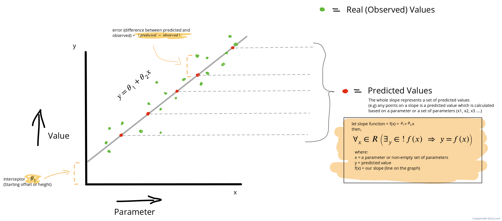

  
  
  

<h1 align="center">Linear regression</h3>

 

  <a href="#-how-it-works" style="padding-right: 12px;"><strong>How It Works</strong></a> •
  <a href="#-when-it-works" style="padding-right: 12px;"><strong>When It Works</strong></a> •
  <a href="#-demo" style="padding-right: 12px;"><strong>Demo</strong></a> •
  <a href="#-usage" style="padding-right: 12px;"><strong>Usage</strong></a> •
  <a href="#-license" style="padding-right: 12px;"><strong>License</strong></a>

---

## 📝 How it works

## 🧠 When It Works
## 📱 Demo
## 💻 Usage
## 📄 License

> One Parameter

$$
\left( \sum_{k=1}^n a_k b_k \right)^2 \leq \left( \sum_{k=1}^n a_k^2 \right) \left( \sum_{k=1}^n b_k^2 \right)
$$